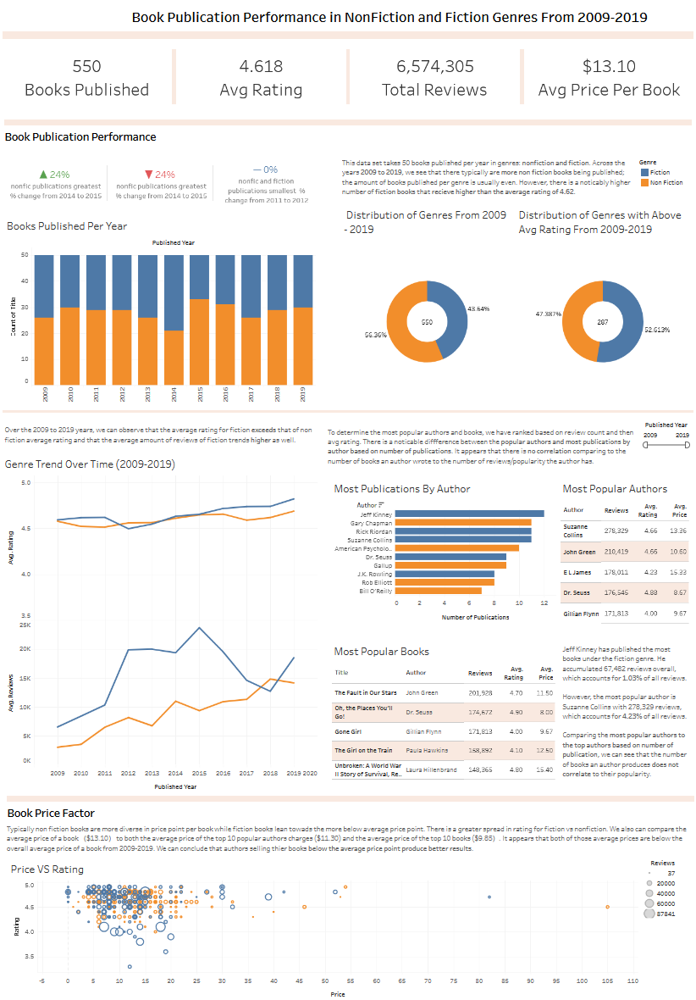

# Amazon-Book-Publications-Analysis
This project explores Amazon books' publication trends from 2009 to 2019. It takes the 50 books from each year that are categorized as fiction and nonfiction. The analysis is visualized on a Tableau dashboard providing insight on consumer preferences and sales trends. It dives deep into genre popularity, sale trends, and top authors based on: number of publications, number of reviews per author, and number of reviews per book title.

## Objective
The objective of this project is to give a better understanding of how the book market has changed over a decade by analyzing:
- Genre distribution changes
- Author Preference
- Popularity Factors (reviews, and number of publications)

## Data Preprocessing
Utilized pandas for the following:
- Renames columns for clarity
- Cleaned author names for readablity and standardization
- Filtered duplicate titles to identify unique books per year
- Deleted duplicate rows

## Key Visualizations
- Section 1: KPIs 
	- displaying the most relevant information of number of books, average rating, total reviews, and average price per book over the decade 
- Section 2.1: Book Publication Performance
	- bar graph showing books genre distribution per year and noted the greatest and smallest change of nonfiction and fiction publications in a one year difference
	- donut pie charts to visualize the genre distribution overall in the decade versus the genre distribution with books having an above average rating
- Section 2.2: Book Publication Performance (with focus on user specified published year range)
	- line graphs comparing average rating and average reviews over time
	- bar graph showing most publications by author
	- tables list most popular authors by reviews and most popular books by reviews
- Section 3: Book Price Factor
	- scatter plot of price vs rating

## Insights
- 2014 to 2015 had the biggest percent change of nonfiction and fiction books published at 24%
- 2011 to 2012 had the same nonfiction to fiction books published
- over the decade, 2009 to 2019, there were more nonfiction books published; however if we observe the books with an above average rating, 4.618, we see that fiction books are more prefered
- fiction books generally are rated higher and recieve more ratings indicating that the general public perfers fiction over nonfiction books
- authors with more publications to not mean they are more popular
- the authors of the most popular books have little relationship with the most popular authors
- comparing the top 10 most popular book price ($9.85), top 10 authors by reives average book price ($11.30), to the overall average price ($13.10), we see that there is better performance with books with lower than average price point

##Tools Used
- Python (Pandas)
- Jupyter Notebook
- CSV Dataset from Kaggle(https://www.kaggle.com/datasets/sootersaalu/amazon-top-50-bestselling-books-2009-2019)
- Tableau
